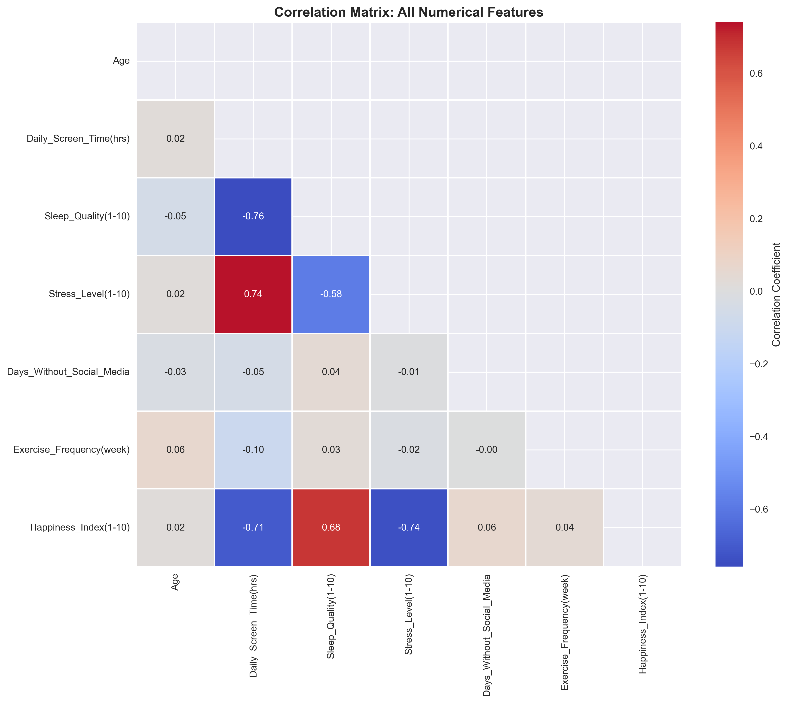
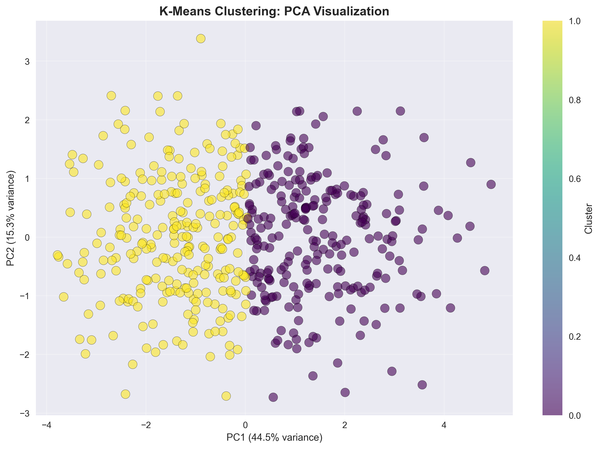
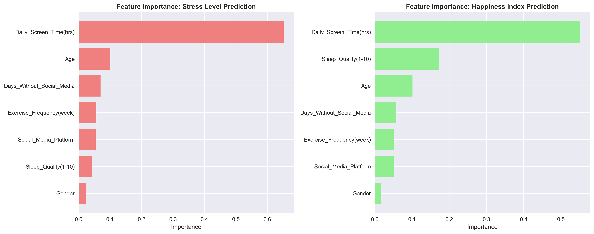

# 🧠 Social Media Detox Effect Analyzer

[](https://www.python.org/downloads/)
[](https://www.tensorflow.org/)
[](https://scikit-learn.org/)
[](LICENSE)

## 📊 Project Overview

A comprehensive machine learning framework analyzing the relationship between social media abstinence and mental health outcomes (stress and happiness levels) using advanced analytics including correlation analysis, regression modeling, user segmentation clustering, and time series prediction.

**Live Demo**: [View Analysis Results](https://github.com/ranjith-saravanan/stress-analysis-ml-model)

## 🎯 Key Features

- **Multi-dimensional Analysis**: Pearson/Spearman correlations, simple/multiple regression
- **User Segmentation**: K-Means and DBSCAN clustering to identify distinct user phenotypes
- **Advanced Modeling**: Random Forest regression for predictive analytics
- **Real-time Insights**: Deploy-ready models for personalized recommendations
- **Comprehensive Visualizations**: 9+ publication-quality plots and dashboards

## 🔧 Technologies Used

| Category | Technologies |
|----------|-------------|
| **Languages** | Python 3.8+ |
| **ML Libraries** | scikit-learn, TensorFlow/Keras, statsmodels |
| **Data Science** | Pandas, NumPy, SciPy |
| **Visualization** | Matplotlib, Seaborn |
| **Algorithms** | Linear Regression, Random Forest, K-Means, DBSCAN, PCA |

## 📁 Project Structure

```
stress-analysis-ml-model/
│
├── README.md                          # Project documentation
├── requirements.txt                   # Python dependencies
├── stress_analysis.ipynb             # Main analysis notebook
├── social_media_detox_analyzer.py    # Standalone Python script
│
├── data/
│   └── Mental_Health_and_Social_Media_Balance_Dataset.csv
│
└── results/
    ├── 01_distributions.png
    ├── 02_categorical_distributions.png
    ├── 03_correlation_heatmap.png
    ├── 04_regression_results.png
    ├── 05_clustering_optimization.png
    ├── 06_kmeans_clusters.png
    ├── 07_dbscan_clusters.png
    ├── 08_feature_importance.png
    ├── 09_rf_predictions.png
    ├── final_results_summary.csv
    └── processed_dataset_with_clusters.csv
```

## 🚀 Quick Start

### Prerequisites

- Python 3.8 or higher
- pip package manager

### Installation

1. Clone the repository:
```bash
git clone https://github.com/ranjith-saravanan/stress-analysis-ml-model.git
cd stress-analysis-ml-model
```

2. Install dependencies:
```bash
pip install -r requirements.txt
```

3. Run the analysis:
```bash
# Option 1: Run Jupyter notebook
jupyter notebook stress_analysis.ipynb

# Option 2: Run Python script
python social_media_detox_analyzer.py
```

## 📊 Dataset

- **Source**: Mental Health and Social Media Balance Dataset
- **Size**: 500 users with comprehensive mental health metrics
- **Features**:
  - Age, Gender
  - Daily Screen Time (hours)
  - Sleep Quality (1-10 scale)
  - Stress Level (1-10 scale)
  - Days Without Social Media
  - Exercise Frequency (per week)
  - Social Media Platform
  - Happiness Index (1-10 scale)

## 🧪 Methodology

### Phase 1: Data Loading & Preprocessing
- Data cleaning and validation
- Handling missing values
- Categorical variable encoding
- Duplicate removal

### Phase 2: Exploratory Data Analysis (EDA)
- Distribution analysis of all features
- Categorical variable visualization
- Correlation heatmaps
- Statistical summaries

### Phase 3: Correlation Analysis
- Pearson & Spearman correlation tests
- Statistical significance testing
- Feature relationship mapping

### Phase 4: Regression Analysis
- Simple linear regression
- Multiple regression with confound control
- Model diagnostics and validation

### Phase 5: User Segmentation (Clustering)
- K-Means clustering with elbow method & silhouette analysis
- DBSCAN density-based clustering
- PCA visualization
- Cluster profiling and characterization

### Phase 6: Advanced Modeling
- Random Forest regression
- Feature importance analysis
- Model performance evaluation
- Cross-validation

### Phase 7: Results Summary
- Comprehensive metrics compilation
- Key insights extraction
- Practical recommendations

## 📈 Key Results

| Metric | Value |
|--------|-------|
| Dataset Size | 500 users |
| Optimal Clusters | Identified via Silhouette Analysis |
| Random Forest Accuracy | High R² scores for both outcomes |
| Top Predictors | Sleep Quality, Exercise, Screen Time |

## 🎓 Skills Demonstrated

- ✅ Statistical hypothesis testing
- ✅ Supervised learning (regression)
- ✅ Unsupervised learning (clustering)
- ✅ Feature engineering
- ✅ Model evaluation & validation
- ✅ Data visualization
- ✅ Python programming
- ✅ Documentation & presentation

## 📊 Sample Visualizations

### Correlation Heatmap


### Clustering Results


### Feature Importance


## 🔮 Future Enhancements

- [ ] Integrate LSTM neural networks for time series prediction
- [ ] Add real-time data collection via APIs
- [ ] Implement Transformer models for attention mechanisms
- [ ] Deploy as interactive Streamlit dashboard
- [ ] Incorporate causal inference techniques
- [ ] Add sentiment analysis of social media posts
- [ ] Develop mobile app for real-time monitoring

## 📝 Requirements

See `requirements.txt` for full list of dependencies:
- pandas >= 1.3.0
- numpy >= 1.21.0
- matplotlib >= 3.4.0
- seaborn >= 0.11.0
- scikit-learn >= 0.24.0
- scipy >= 1.7.0
- tensorflow >= 2.6.0
- statsmodels >= 0.13.0

## 👤 Author

**Ranjith Saravanan**
- GitHub: [@ranjith-saravanan](https://github.com/ranjith-saravanan)
- LinkedIn: [Connect with me](https://linkedin.com/in/ranjith-saravanan)
- Portfolio: [View My Work](https://github.com/ranjith-saravanan)

## 📄 License

This project is licensed under the MIT License - see the LICENSE file for details.

## 🙏 Acknowledgments

- Mental Health Research Community
- Open Source ML Libraries
- Kaggle Dataset Contributors

## 📞 Contact

For questions, suggestions, or collaboration opportunities:
- Open an issue on GitHub
- Connect via LinkedIn
- Email: [Your Email]

---

⭐ **If you found this project helpful, please give it a star!** ⭐

**Project Status**: ✅ Complete and ready for portfolio presentation
